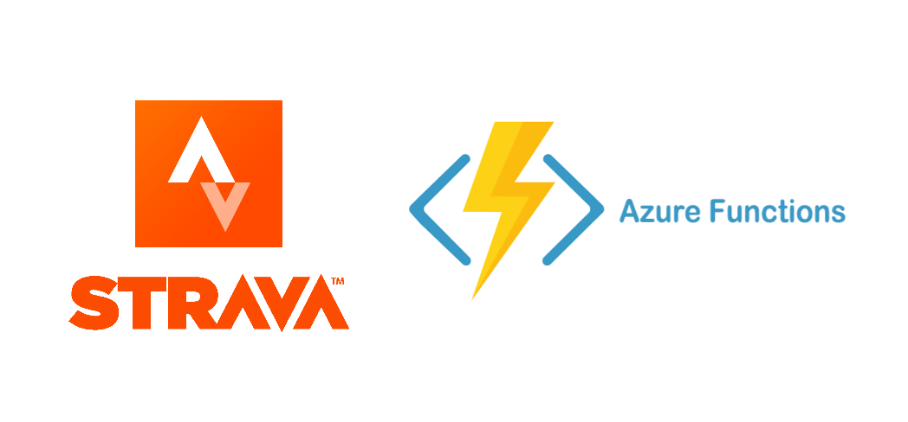

# strava-azure-functions

Azure Functions to retrieve Strava Data

## Strava Token Renewer

An Azure Timer Function to renew the AccessToken every 5 hours with the refresh token and storing it in a Azure-storage table.

## Strava Latest Activity

An Azure HTTP trigger function to retrieve my latest run/ride activities using the AccessToken stored in the Azure-storage table

## Strava Authorize

An Azure HTTP trigger function to redirect to the Strava authorize page.  
The ClientID is pulled from the Azure-storage table.  
The authentication callback is the next function

## Strava Get Token

An Azure HTTP trigger function to request the token using the code returned by the authentication callback.  
The ClientID/Client secret are pulled from the Azure-storage table.

## Local Testing

Run `npm run start`.

You can Renew the token manually by making a POST to `http://localhost:7071/admin/functions/StravaTokenRenewer` (with an `{}` in the body).
